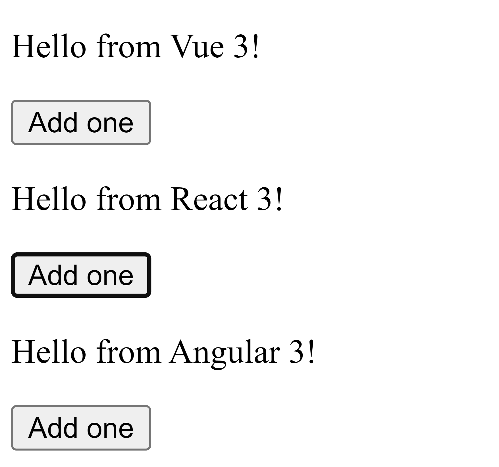

# Multi-Framework Redux Demo

This repo demonstrates how you can mix-n-match the [Redux](https://redux.js.org/) adapters for:

- [React](https://github.com/reduxjs/react-redux)
- [Angular](https://github.com/reduxjs/angular-redux)
- [Vue](https://github.com/reduxjs/vue-redux)

Using [Vite](https://vitejs.dev/) as the build tooling for all three apps in one.

